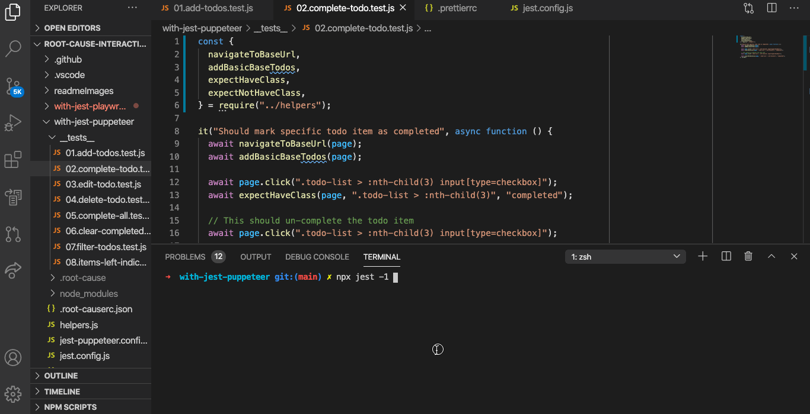
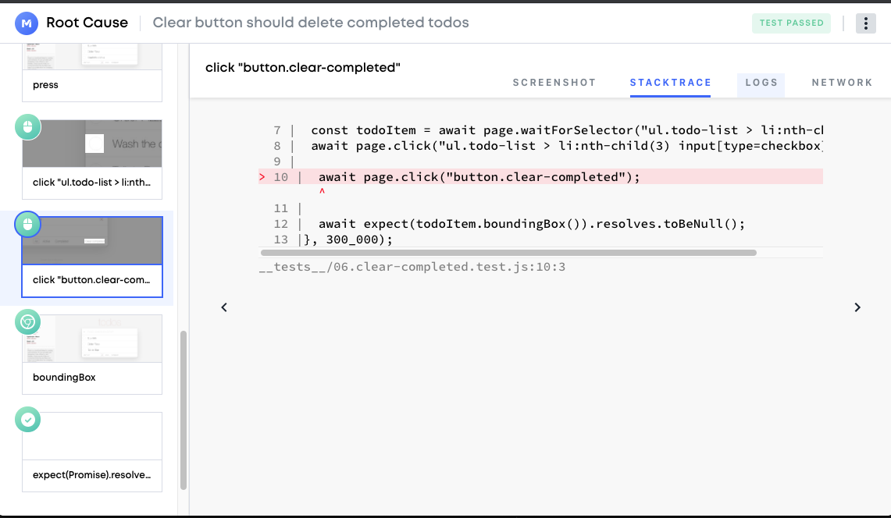
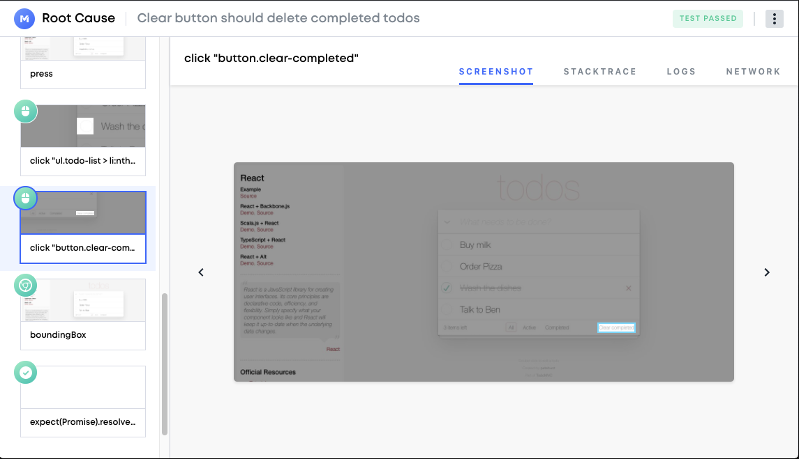

# Testim Root Cause Demo

[Testim Root Cause](https://github.com/testimio/root-cause) is an open source tool for troubleshooting 🔎 Puppeteer and Playwright tests (And your preferred test runner).

### To quickly run the demo (You can open it in a new tab, and let it load while reading):

[](https://gitpod.io/#snapshot/f6c20016-c62b-4f4f-b128-54ae5a305340)

(If you are already in GitPod, follow the terminal)

<p align="center"></p>

## What's inside

In the demo, we have E2E tests for the popular [TodoMVC](http://todomvc.com/) project, written with jest and puppeteer in the with-jest-puppeteer folder, and in with-jest-playwright we have the same tests, but with playwright.

<p align="center">

</p>

## Running the demo

### GitPod

You may [run the demo in GitPod](https://gitpod.io/#https://github.com/testimio/root-cause-interactive-demo) (online, in-browser dev environment),  
Or locally by cloning the repo.

If you are inside GitPod, you should already see tests run in the terminal, and example test result will be opened for you.

### Locally

If you are running the demo locally, follow these steps:

cd into `with-jest-puppeteer` directory

```sh
cd with-jest-puppeteer
```

Install dependencies

```sh
npm install
```

Run the tests

```sh
npx jest
```

List results

```sh
npx root-cause ls
```

Pick one of the results to open Root Cause Viewer

```sh
npx root-cause show
```

## Integration, feedback and issues

To learn more about root cause, and for integration instructions, visit our homepage: [https://help.testim.io/docs/testim-overview](https://help.testim.io/docs/testim-overview)

If you've encountered any issue, or you have any feedback please open us an issue at https://github.com/testimio/root-cause/issues
